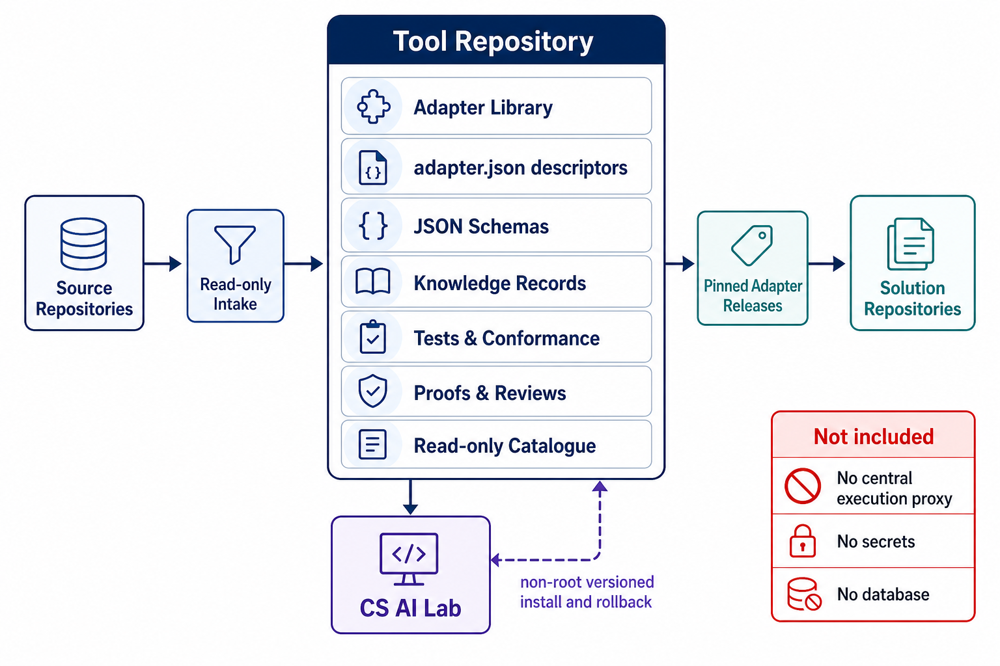

# Completed-state architecture

The Tool Repository is a source-first, governed library of reusable adapters.
It accepts candidate assets only through read-only intake, retains their
descriptor, schema, knowledge, tests, conformance evidence, and reviews, then
publishes immutable releases for solution repositories to consume locally.

It does not execute adapters centrally, store solution secrets, or require a
database. The CS AI Lab installs versioned repository releases under a non-root
account and can roll back locally. A future catalogue is read-only discovery and
release resolution; adapter execution remains inside each consuming solution.

## Knowledge relationship

Each active adapter links its user guide and JSON knowledge records from its
`adapter.json` descriptor. Knowledge distinguishes validated, evidenced use from
suggested use. It is part of the adapter release, not a separate runtime or
central service.
